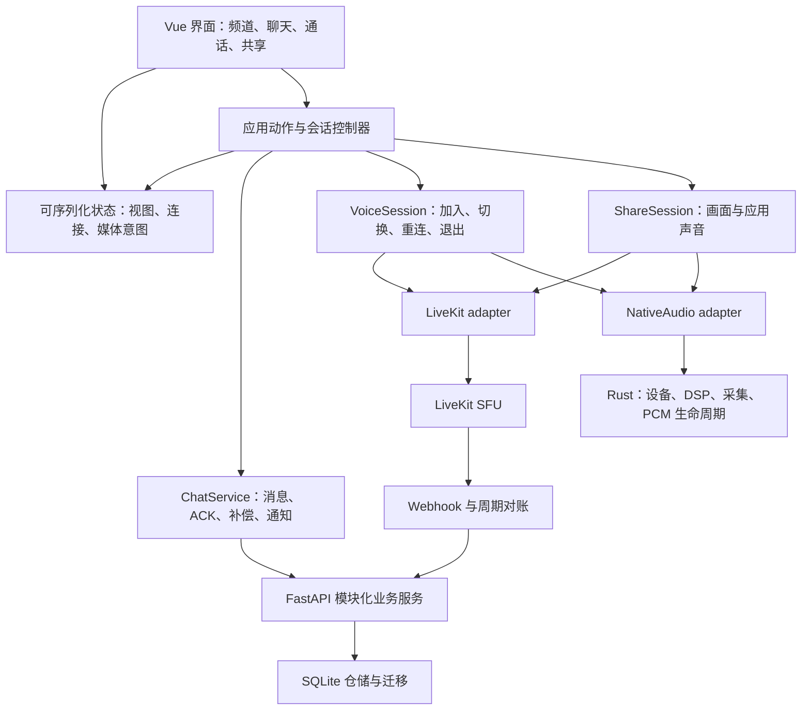

# DoNiChannel 架构、逻辑与产品演进审查

审查日期：2026-09-22。基线：`fd587d919f5f5e770831305a1ef243de466cb15f`，客户端版本 `0.1.1`。

**结论**

现有技术选型适合继续发展：保留 Vue + Tauri/Rust + FastAPI + LiveKit。Rust 处理本机音频、Python 处理业务数据、LiveKit 处理实时媒体，这个分工是合理的。当前更需要完善状态、生命周期和协议边界，而不是换语言或拆微服务。

项目已超过纯原型：有 Presence 有序协议、麦克风 generation/cancellation、数据库迁移与备份、npm 本地 SDK、签名更新、发布脚本和 CI。但距离稳定的游戏语音产品仍有缺口。P0/P1 建立了基础；它们的单元测试通过，并不意味着断网、设备失效、快速切频道、共享停止等业务路径已经闭环。

建议定位为“面向熟人游戏小队的轻量语音与共同观看空间”。按应用分享声音、每成员分音源音量、虚拟局域网部署可成为特色。先把这些体验做可靠，再扩展频道、长期聊天和社交功能。

**范围和证据等级**

- 阅读当前前端、Rust 音频、Python 服务、测试、CI/更新和部署相关代码；参考了工作区先前 P0/P1 实施及架构讨论。
- 使用 GitHub 插件核对最近提交；检索结果与本地 HEAD 相符。没有创建 PR、提交或推送。
- 沿用先前讨论的可信虚拟局域网使用前提，本轮重点是正确性、可维护性、性能与体验。
- “复现确认”：通过真实模块加模拟依赖，或临时数据库执行得到的结果。
- “代码确认”：可从当前调用路径确定的问题，但未在双机桌面环境触发。
- “待实测”：需要真实 WASAPI、WebView2、网络和多客户端验证的表现。没有把推断当作实际听感、延迟或容量数据。
- 本轮只新增这份报告，没有修改业务代码。未启动实际语音会话、未操作麦克风或共享屏幕，也未安装更新。

**一、优先修复的正确性问题**

严重度“高/中”用于问题排序，与历史 P0/P1 阶段名称无关。

| ID | 严重度 | 问题 | 证据 |
|---|---|---|---|
| R01 | 高 | Chat 首次连接失败，调用者可能一直等不到返回 | 复现确认 |
| R02 | 高 | LiveKit 最终断开后仍可能显示已连接，并阻止重进同频道 | 代码确认；频道清空另有复现 |
| R03 | 高 | PCM WebSocket 断开后复用失效管线，重新开麦仍可能无声 | 复现确认 |
| R04 | 高 | 快速切频道时文字视图、订阅与语音频道可以分离，发送目标不清楚 | 代码确认 |
| R05 | 中 | 历史回填覆盖自己的消息身份 | 复现确认 |
| R06 | 中 | 相同消息 ID 重发会覆盖已存消息并清空 reaction | 复现确认 |
| R07 | 中 | 多应用混音等待最慢源；静音源也参与音量平均 | 代码确认；设备表现待实测 |
| R08 | 中 | 远端音频回退到 HTMLAudioElement 时仍保持 muted | 复现确认 |
| R09 | 中 | 屏幕共享参数层级错误，外部停止没有完整状态清理 | SDK 源码与调用路径确认 |
| R10 | 中 | 聊天补偿和分页不足以保证历史完整 | 分页复现确认；补偿边界代码确认 |

**R01：Chat 的超时没有覆盖真正的连接等待**

位置：[chatClient.js:80](F:/livekit_pack/ui/src/features/chatClient.js:80)、[chatClient.js:163](F:/livekit_pack/ui/src/features/chatClient.js:163)、[runtime.js:806](F:/livekit_pack/ui/src/app/runtime.js:806)。

`ensureConnected(timeoutMs)` 先 `await connect()`，再调用带超时的 `waitUntilConnected()`。但 `connect()` 创建的 Promise 仅在 `onopen` resolve；`onerror` 只记录日志，`onclose` 只调度重连，均不结束原 Promise。第一次握手失败，即使后续新 socket 连接成功，也不会替原 Promise resolve。

复现：模拟 socket 在打开前 error/close，传入 20ms 超时，100ms 后调用仍 pending。实际影响包括发送消息停在等待阶段、大厅动作迟迟不结束。另有固定 1.5 秒重连、缺少 socket generation 隔离等差距；Presence 已具备其中一些保护，Chat 尚未复用。

建议：连接 Promise 覆盖超时、错误、关闭、取消的所有出口；同一次连接共享 Promise；回调绑定候选 socket，旧 socket 无权清空新连接。补充应用层心跳/超时，或明确验证部署中的协议层 ping 策略。ACK 也需要独立期限，不能将 `socket.send()` 成功当作送达。

验收：服务不可达、握手失败、黑洞网络、断开后重连均有有界返回；消息最终处于 sent 或可重试失败状态。

**R02：连接状态以对象是否存在判断，无法表达真实断线**

位置：[runtime.js:611](F:/livekit_pack/ui/src/app/runtime.js:611)、[runtime.js:697](F:/livekit_pack/ui/src/app/runtime.js:697)、[roomConnection.js:259](F:/livekit_pack/ui/src/features/roomConnection.js:259)、[appStore.js:68](F:/livekit_pack/ui/src/stores/appStore.js:68)。

`isConnected` 使用 `!!(room && room.localParticipant)`。LiveKit 的 Room 构造时就创建 localParticipant，它的存在不等于连接成功。最终 Disconnected 处理只清除成员并同步 store，没有清除 room/currentChannel、音频资源或明确进入 failed 状态。随后点击同一频道又可能被 `currentChannel === roomName && room` 提前返回挡住。

还有独立问题：`snapshot.currentChannel ?? oldValue` 无法用 null 清空频道。最小复现先同步 day0，再同步 null，store 仍为 day0。

建议：用 SDK connection state 映射 `disconnected/connecting/connected/reconnecting/failed`；区分临时重连与最终断线；最终断线释放资源或建立显式重连入口。nullable 字段用“是否提供字段”区分保留和清空。

验收：服务重启、被移出房间、重连耗尽后，界面准确显示状态；同频道可重进；频道可真正清空。

**R03：PCM 管线的就绪标志在断开后仍为真**

位置：[audioPipelines.js:129](F:/livekit_pack/ui/src/features/audioPipelines.js:129)、[audioPipelines.js:177](F:/livekit_pack/ui/src/features/audioPipelines.js:177)、[rustMic.js:264](F:/livekit_pack/ui/src/features/rustMic.js:264)。

PCM 的运行期 onclose 仅打印日志，不失效 ready 标志、不结束 track、不通知上层。下一次初始化只检查 ready 和 AudioContext 采样率，直接返回旧 track。Rust 的 mic_error 回调同样主要更新 UI，没有完整撤销 publication 和 PCM 管线。

复现：初始化 9002 → 模拟 socket 关闭 → 再次初始化；socket 总数仍为 1，返回相同 track，socket 状态为 CLOSED。此处验证了管线复用缺陷，未模拟真实设备热拔插。

建议：pipeline session 持有 generation、socket、context、track 和统一 dispose；运行期失败进入 failed，失效 ready；重试时新建管线。只有 socket OPEN、context 可用且 track live 才允许复用。

**R04：快速切频道可造成看见的聊天与发送目标不同**

位置：[runtime.js:976](F:/livekit_pack/ui/src/app/runtime.js:976)、[roomConnection.js:256](F:/livekit_pack/ui/src/features/roomConnection.js:256)、[runtime.js:777](F:/livekit_pack/ui/src/app/runtime.js:777)。

外层 switchChannel 先切 chatStore，内层才检查 `isSwitchingChannel`。A→B 进行中再点击 C，第二个内层动作直接返回，但外层仍切文字视图和订阅 C；B 完成又可能订阅 B。与此同时发送目标取的是 roomConnection 当前频道，而非用户正在看的文字频道。

另外，`chat_subscribed` 的回复会反向改写 desired channel，旧 ACK 可以短暂回滚新选择。当前双状态模型不是有意设计的“语音与文字分离”。

建议：近期为切换命令统一串行化或采用“最后一次意图优先”的 generation，返回明确结果后再提交 UI 状态；长期显式分开 `viewedChannelId` 和 `voiceChannelId`，发送目标只来自文字视图，语音连接不因浏览文字频道而改变。

验收：A→B→C 连点、B 连接失败、切换中取消，均不存在跨频道误发；最终选择与实际状态可解释。

**R05：历史加载把自己的消息变成他人的消息**

位置：[chatStore.js:479](F:/livekit_pack/ui/src/stores/chatStore.js:479)、[server/db/chat.py:91](F:/livekit_pack/server/db/chat.py:91)。

历史接口返回 `isSelf: false`；前端回填时 selfId 为空，并把整条标准化消息覆盖到已有记录。复现中一条 `isSelf: true` 的本地消息在 loadServerHistory 后变成 false。影响左右/头像样式、自我提及判断等。

建议：服务端只提供 senderId；isSelf 始终由本机稳定 userId 推导，不持久化为服务端权威字段。历史合并保留尚未确认的本地发送状态，并统一 ID 匹配规则。

**R06：重试不幂等，会破坏已有消息**

位置：[server/app.py:894](F:/livekit_pack/server/app.py:894)、[server/db/chat.py:16](F:/livekit_pack/server/db/chat.py:16)。

服务端每次发送都重新生成 timestamp、设置空 reactions，再执行 INSERT OR REPLACE。复现：发送同一 clientMessageId → 加入 reaction → 再发送同 ID，reaction 变为 `{}`。当前正常一次发送不一定触发，但 ACK 丢失后的可靠重试必须先解决这个问题。

建议：用服务端 messageId 和 `(senderId, clientMessageId)` 唯一约束。重复请求返回已存在结果，保留原 timestamp/content/reactions，不重复广播创建事件。Reaction 从 toggle 命令升级为带 requestId 的显式添加/删除，便于安全重试。

**R07：多源音频应按时间混合，而不是等待所有源攒齐样本**

位置：[engine.rs:469](F:/livekit_pack/src-tauri/src/audio/engine.rs:469)、[engine.rs:511](F:/livekit_pack/src-tauri/src/audio/engine.rs:511)、[engine.rs:534](F:/livekit_pack/src-tauri/src/audio/engine.rs:534)。

当前所有未关闭源至少各有 480 个样本才输出一块；某源仍存活但暂不产出时，其他源也无法输出。pending_samples 使用没有上限的 VecDeque，快源积压没有明确时间预算。不能断言“所有静音应用一定卡住”：微软示例说明无渲染流时可以返回静音，实际驱动行为需验证；可以确定的是当前算法没有处理源迟到或停顿。

此外，混音用 `sum / count`，静音源也计入分母：一个有声源加一个静音源，幅度降为一半，约 -6dB。源数量改变还会改变响度。应用声音又被 `(L+R)/2` 压成单声道，失去游戏方向与音乐声场信息。

建议：统一采样率、声道和时间戳；固定混音时钟；每源有限缓冲；迟到源补零/淡入，及时丢弃过期样本；每源增益后求和，再用带平滑包络的 limiter。声源静音不应让其他声源突然变轻。应用/观影模式保留立体声，语音维持单声道即可。

进程枚举按名称归组并过滤 30MB 以下进程，适合作为原型，不等于枚举真实音频会话；同名多实例可能选错来源。后续优先按 Windows 音频会话、窗口和进程树展示，再保留高级 PID 选择。

**R08：音频回退路径仍处于静音**

位置：[livekitEvents.js:234](F:/livekit_pack/ui/src/features/livekitEvents.js:234)、[remoteAudio.js:14](F:/livekit_pack/ui/src/features/remoteAudio.js:14)。

订阅音轨时先把 audioEl.muted 设为 true，用 WebAudio GainNode 播放；如果 AudioContext 不可用或创建路由失败，fallback 只修改 volume，未取消 muted。复现结果为 `{muted:true, volume:0.7}`，回退不会发声。

建议：播放路由显式选择 webaudio 或 element，进入 element 模式恢复 muted 并处理播放失败；音量超过 100% 时明确说明原生元素回退的上限。

**R09：屏幕共享的采集选项和停止状态不完整**

位置：[screenShare.js:201](F:/livekit_pack/ui/src/features/screenShare.js:201)、[livekitEvents.js:325](F:/livekit_pack/ui/src/features/livekitEvents.js:325)。

传给 LiveKit 的 `captureOptions` 对象又嵌套了 `captureOptions: getDisplayMediaConstraints(...)`。锁定依赖的 ScreenShareCaptureOptions 与转换函数没有读取此嵌套字段，因此其中的自定义音频参数、displaySurface 等不会如预期传给浏览器；顶层 resolution 仍生效，不能据此断言分辨率设置全无效。`systemAudio` 应作为顶层选项。[LiveKit 2.22.3 接口](https://docs.livekit.io/reference/client-sdk-js/interfaces/ScreenShareCaptureOptions.html)

用户通过系统“停止共享”结束时，LocalTrackUnpublished 只隐藏预览，没有统一重置 screenOn、按钮、设置禁用状态和码率 timer。下一次按钮操作可能只是处理旧状态。取消授权还会走再次请求纯视频的 fallback，应区分“用户主动取消”和“音频能力不支持”。

建议：集中管理共享会话；通过 typed SDK adapter 构造选项；按钮停止、系统停止、track ended、房间断线走同一 cleanup。共享结果明确区分画面、系统音频、应用音频。

**R10：历史同步不是完整的断线补偿协议**

位置：[runtime.js:217](F:/livekit_pack/ui/src/app/runtime.js:217)、[chatStore.js:455](F:/livekit_pack/ui/src/stores/chatStore.js:455)、[server/db/chat.py:59](F:/livekit_pack/server/db/chat.py:59)。

重连仅拉最新 80 条，未根据最后收到的服务端游标循环补齐；断线期间超过 80 条会留下空洞。分页只用 timestamp `< before`，相同毫秒内的消息跨页会遗漏。临时数据库中插入 3 条同 timestamp 消息、每页 2 条，翻页总共只拿回 2 条。

建议：聊天使用每频道单调 serverSeq；恢复时按 sinceSeq 补齐，历史向前分页用稳定复合游标或 seq。保留窗口之外返回明确 history_truncated，让用户知道历史被保留策略裁剪。

**二、其他值得排期的问题**

| 项目 | 当前事实 | 建议 |
|---|---|---|
| 服务端广播 | Presence 和 Chat 都串行 await 每个连接发送，没有独立发送队列/超时 | 每连接有界队列与单 writer，隔离慢客户端；Presence 保持 seq 顺序，超限后强制重新同步 |
| SQLite 访问 | async handler 直接执行同步查询/commit；busy_timeout 为 5 秒 | 监测 event-loop lag；整体事务放入线程执行或使用异步仓储；不要简单拆散 reaction 读改写造成新竞争 |
| 其他频道人数 | 当前语音频道以 LiveKit 为准是正确的；其他频道仍由客户端 join_channel 声明 | 接入 LiveKit webhook，并用周期查询对账处理漏事件；Presence 在线与 voice membership 分开 |
| 聊天持久化 | 服务端每频道仅保留 500 条，客户端 200 条 | 产品层明确保留策略；区分服务端档案和本地缓存，不把缓存上限当历史上限 |
| 本地缓存键 | 只按频道名命名；中文/特殊字符替换为下划线；不同服务器没有命名空间 | 使用 serverId + 不变 channelId；频道 displayName 可改名；避免中文同长度频道或多服务器串缓存 |
| 未读/提及 | 已有计数和提及识别，但只订阅当前聊天频道，没有后台各频道事件 | 建立空间级轻量通知流、lastReadSeq 与服务端摘要；不要把已有计数 UI 当完整离线未读 |
| Reaction 回退 | WS 不可用时回退 REST，REST 只持久化而不广播 | 统一进入同一业务 service 并产生同一种事件；失败时回滚乐观 UI |
| 实时网络统计 | 丢包率取累计值；RTT 取最后遍历到的相关条目；依赖 SDK 内部 pcManager | 按 track/SSRC/方向做采样窗口 delta，重连换轨重置基线；RTT 标注客户端到 SFU 往返，不等同语音端到端延迟 |
| 更新版本比较 | 自写 _version_key 按字符串比较 prerelease，且把 +build 当预发布 | 使用标准 SemVer 比较；复现 beta.10 不大于 beta.2、build 元数据改变优先级；普通 0.1.0→0.1.1 不受这个案例影响 |
| 发布门禁 | main/PR CI 有测试；tag release 自身没有完整测试门禁 | release 复用验证任务或验证同一 SHA 的已通过检查，保留 draft 发布和签名 |
| 日志 | 插件已注册，但音频核心大量 println；前端记录完整聊天事件 | 统一日志入口、级别和轮转，确认发行版能采集音频故障日志；避免按帧/正文刷日志 |

SemVer 的 prerelease 数字段需要数值比较，build 元数据不参与优先级。[SemVer 2.0.0](https://semver.org/)

**三、架构是否好用**

语言/进程边界合理，模块内部尚未达到同样清晰的职责分离。当前物理行数（含空行）为 server/app.py 1907、audio/engine.rs 1690、runtime.js 1246、ChatPanel.vue 1578。行数仅是定位线索，真正的问题是职责交叉：

- runtime 同时装配依赖、维护全局状态、处理消息、历史补偿、Presence 对账和 DOM 兼容；shared/apiClient 又通过 window.__chatClient 获取实例，依赖方向绕回运行时。
- server/app.py 仍包含 PresenceManager、ChatManager、路由、上传和部分资料 SQL；realtime/hub.py 目前只是 send_text 包装，不是完整的连接生命周期管理层。
- Rust engine 仍包含设备枚举、command 实现、WASAPI、混音、VAD、WebSocket pump。lib.rs 已薄化，但核心引擎仍需继续按可测试边界拆分。
- Vue 与手写 DOM 同时管理界面。roomConnection 的 `#header.innerText` 会移除 MainStage 由 Vue 渲染的标题和状态节点；重新渲染依赖具体更新时机。媒体 track.attach 的 DOM 操作有必要，整块业务 UI 用 innerHTML/innerText 管理则会增加冲突。

建议采用“模块化单体 + 明确状态机”，保持一个 FastAPI 服务和现有 Tauri 进程：

前端不必立即全部改 TypeScript；优先给 Chat/Presence 消息、LiveKit adapter、Tauri command 参数和 session 状态加类型。JavaScript 可以先用 JSDoc/checkJs，避免本次屏幕参数层级错误。Pinia 可选；选不选 Pinia 不是当前状态重复的根因。

服务端把路由放 api，业务放 services，连接/广播放 realtime，SQL 放 db；同一聊天业务供 REST/WS 调用，避免兼容入口行为分叉。Rust 优先拆 device、microphone、process_loopback、mixer、vad、transport；先拆可测函数，再迁移 Windows 调用，不在纯重构里同时调音质。

把非序列化资源放 controller/adapters，用事件更新 store。不要把整个 LiveKit Room 放入深响应式对象。每个资源只有一个所有者，关闭函数幂等；用会话 generation 防止旧任务修改新状态。P0 的 Rust 麦克风模型可保留并扩展到应用音频、屏幕和房间连接。

**四、算法与音频质量判断**

| 链路/算法 | 判断 | 改善方向 |
|---|---|---|
| RNNoise 分帧与量纲 | 48kHz、480 样本/帧、输入乘 32768、输出除回去，方向正确 | 保留；补真实录音离线用例，覆盖小声、短词、爆破音、键盘声与多人背景声 |
| VAD | 概率+音量、开闭滞回、尾部保持、渐变有意义 | 与增益解耦；明确低阈值行为；按场景校准，不凭听感盲调 |
| VAD 前滚 | 固定保留 12×480 样本，在 48kHz 下引入 120ms 延迟 | 这是明确成本；实验对比 20/40/60/120ms，结合漏字率与端到端延迟选择 |
| Limiter | 有有限值保护、帧峰值保护和 soft knee，能限制幅度 | 当前帧独立缩放且 VAD 输出又 soft_limit 一次；评估跨帧增益跳变与重复压缩，使用带 attack/release 的包络 |
| PCM ring buffer | 有界、统计下溢/过载、轻微追赶，优于无界积压 | targetLatency 不是实际预缓冲；目前只在有积压时追赶，不主动维持目标库存；硬件时钟漂移需要估计与连续重采样 |
| PCM 严重积压恢复 | 找低幅度点有帮助 | 只看单点幅值不等于拼接两端连续；增加短交叉淡化并测 clicks，不把逐样本跳过当高质量重采样 |
| 应用混音 | 当前能做简单汇总 | 需补时间轴、源隔离、声道策略、稳定响度；优先级高于新增效果器 |
| Presence 协议 | epoch + seq + snapshot/diff + TTL 的方向正确 | 保持当前频道权威合并；完善实际语音成员对账和慢消费者隔离 |
| Chat 协议 | ACK、乐观显示、历史合并已有基础 | 补幂等、ACK timeout、稳定游标、补偿、后台未读，形成完整交付语义 |
| 共享码率统计 | deltaBytes×8/deltaTime 的换算正确 | 锁定同一 stats ID/SSRC，换轨重置；目前是监控，不是自研自适应码率算法 |

RNNoise 的 PCM 范围与处理语义可参考库源码文档；本项目没有自行训练降噪模型。[nnnoiseless](https://docs.rs/crate/nnnoiseless/latest/source/src/denoise.rs)

不能把 Worklet 的 100ms target、Rust 24 帧队列容量和 VAD 120ms 简单相加成“实测延迟”：前两者分别是恢复阈值/容量，运行时占用不固定。可以确定的是 VAD 在稳定输出时把样本延后 120ms。`captured_at_micros` 在 VAD 输出后记录，又没有完整用于播放端对齐，因此目前诊断也无法直接测出这段采集延迟。

原生麦克风路径没有看到使用远端播放参考的 AEC。RNNoise 降噪不能等价替代回声消除；浏览器麦克风的 echoCancellation 参数也不会自动作用到 Rust 注入的 PCM。耳机游戏场景可先作为主要支持模式；外放场景需要单独的回声验收，评估浏览器采集路径或原生 AEC 的成本。

屏幕共享当前固定 H.264、关闭 simulcast、contentHint=motion，适合作为某些游戏共享场景的初始选择，不是所有场景的最优配置。浏览代码/文字应有 detail/text 模式；混合带宽观众需评估分层编码与选择订阅。CPU、编码器支持和带宽决定可用方案，不建议现在无数据强切某个 codec。[LiveKit 视频配置说明](https://kb.livekit.io/articles/3859313029-configuring-the-client-sdk-for-optimal-video-quality)

**五、UI 与产品结构**

从代码看，已有头像资料、图片、表情回应、提及识别、本地未读、每人分音源音量、共享参数和连接统计，不应把它们全部当作“尚未开始”。问题主要是功能入口与状态边界还没有形成稳定的一致体验。这里是代码和信息结构审查，没有做桌面逐屏视觉验收。

优先整理三个使用流程：

1. 打开软件 → 看见队友 → 进入语音 → 立即知道自己是否静音、是否能听到、网络是否在恢复。
2. 保持语音 → 浏览其他文字频道 → 发送/回复/查看未读 → 回到通话，不发生语音重连。
3. 选择窗口/屏幕 → 选择声音来源 → 开始共享 → 观众明确进入观看 → 系统停止后双方状态立即恢复。

推荐布局是频道侧栏、主内容区、可选成员/聊天面板、固定通话控制条。单服务器阶段不必先加空的服务器图标栏。普通用户看到“流畅/清晰/游戏”预设，分辨率/FPS/码率放高级设置。麦克风开关、耳机静音、PTT、输出设备、共享来源应有明确文案和状态，避免仅靠 emoji 和 hover。

成员音量拆成语音、屏幕音频、应用音频是现有优势；进一步增加总音量与快速重置、记住设备/成员偏好。应用选择优先显示窗口名、图标、有无正在输出声音，PID/内存作为高级信息。语音诊断用“麦克风有输入但尚未发布”“正在重连”“输出设备不可用”等可行动提示。

长期保留的特色可以是：一键游戏小队空间、临时语音房、按游戏记忆的音频方案、应用声音分享与人声分别调节、共同观看时的语音 ducking。先做后两项的小规模验证，避免同时扩展机器人、商城、复杂权限、视频录制等维护面。

**六、后续 phase 与验收门槛**

为避免与已经完成的 P0/P1 混淆，下面从 Phase 1.5 开始。按完成标准推进，不把阶段完成等同于“文件已拆完”。

| 阶段 | 目标与主要工作 | 完成标准 |
|---|---|---|
| Phase 1.5：正确性收口 | R01–R04 优先；接着 R05/R06/R08/R09/R10；应用混音加有界保护；回归用例固定到 CI | 不可达/超时必返回；无跨频道误发；失效 PCM 能重建；重复消息不覆盖；系统停止共享后 UI/资源一致 |
| Phase 2：状态与模块边界 | 文字视图/语音连接分离；Room/PCM/Share session；拆 runtime、server/app、engine 的职责；为协议和 SDK adapter 加类型 | 新 UI 不依赖全局 DOM ID；连接恢复有唯一入口；模块可通过 fake transport 测试；重构与音质调参分批交付 |
| Phase 3：游戏语音体验 | PTT、全局快捷键、独立耳机静音、热插拔、托盘、设备回退；优化 VAD 延迟、混音、音量包络、诊断 | 双机实测延迟/漏字/CPU；断网、休眠、设备替换自动恢复或清楚提示；8 小时通话资源无持续增长 |
| Phase 4：聊天与频道产品化 | 不变 channelId、频道类型/分类/排序；文字可独立使用；幂等发送、ACK 重试、游标补偿、后台未读、明确历史保留 | 保持语音可浏览多频道；断线超过一页消息可补齐；同毫秒消息不漏；中文频道/多服务器缓存不串；失败消息可重试 |
| Phase 5：屏幕与应用共享特色 | 共享来源预览、画质预设、文字/游戏模式、观众主动观看、按应用声音、立体声、观看音量/ducking | 一名弱网观众不导致所有人不可用；停止/恢复/换源可回归；声音来源明确，无非预期双重播放；2–3 人先试用再扩容 |
| Phase 6：长期运行与分发 | LiveKit 成员对账、慢客户端隔离、事件循环监控、数据库备份恢复、精确版本门禁、稳定/测试更新通道 | 5/10/20 人逐级压测并记录瓶颈；测试数据库可恢复；失败更新可诊断；发布来自经过验证的同一提交 |

质量验收应从 Phase 1.5 持续开展，Phase 6 是扩展长期运营能力，不是第一次做测试。阶段 2 可先交付频道状态模型，阶段 3 的 PTT/托盘等交互可在边界稳定后逐项加入。阶段 5 的共享停止和错误参数问题必须在 Phase 1.5 修复，不能等到画质优化阶段。

建议先建立真实基线再设 SLA：在相同两台机器和相同网络上测采集到播放延迟 p50/p95、短句漏字率、PCM 队列峰值、下溢、重连恢复时间、CPU/内存/句柄。可把“正常局域网语音 p95 尽量低于 150ms”作为候选体验目标，而不是当前性能承诺；现有 120ms VAD 本身已占据很大预算。

每次阶段完成保留至少以下回归：快速切频道 20 次、开关麦 20 次、服务端重启、10/30/60 秒网络中断、休眠恢复、拔插麦克风/耳机、共享应用暂停/退出、系统停止共享、两个发送者同时间发消息、ACK 丢失重发、首次连接失败、8 小时运行。协议故障用自动测试，真实设备与双机听感用人工测试记录。

公网/陌生人产品化如果成为明确目标，再另立身份、权限、配额和滥用防护阶段；不能直接把可信虚拟局域网的假设带入公开服务。本轮不以该方向扩大当前改造。

**七、本次验证记录**

| 检查 | 结果 |
|---|---|
| `npm test --prefix ui` | 13 项通过 |
| `npm run build --prefix ui` | 成功，JS 846.08kB、gzip 245.44kB；有大 chunk 与混合静态/动态 import 提示 |
| `python -m unittest discover -s tests -p "*_tests.py" -v` | 8 项通过，使用临时数据库 |
| `cargo test --locked --offline` | 10 项通过 |
| Chat 连接失败最小复现 | 指定超时后仍 pending |
| store 清空频道复现 | null 未清空 day0 |
| PCM socket 关闭后重新初始化复现 | 未创建新 socket，复用旧 track |
| 远端 audio 回退复现 | muted 仍为 true |
| 自己消息的历史回填复现 | isSelf 从 true 变为 false |
| 服务端重复消息复现 | 已有 reaction 被清空 |
| 同毫秒分页复现 | 3 条记录只返回 2 条 |
| 更新 SemVer 边界复现 | beta.10/beta.2、build 元数据优先级均不符合规范 |

前端测试和构建最初被环境的子进程限制（spawn EPERM）阻止，允许执行后通过，不能把首次失败归因于项目代码。Python 测试出现 Starlette/httpx 弃用提示，不影响本次通过结果。

现有自动测试没有证明真实设备音质、端到端延迟、游戏负载下稳定性、多人容量、安装升级成功或视觉交互完整性。上述数据必须在后续阶段采集。

本项目下一步最值得做的是 Phase 1.5，再交付 Phase 2 的频道状态分离。这样之后的 UI 和功能投入才能建立在可预测的行为上。
